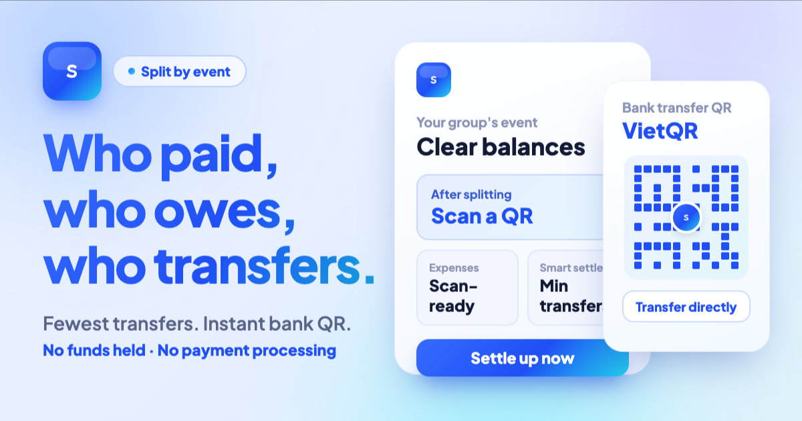
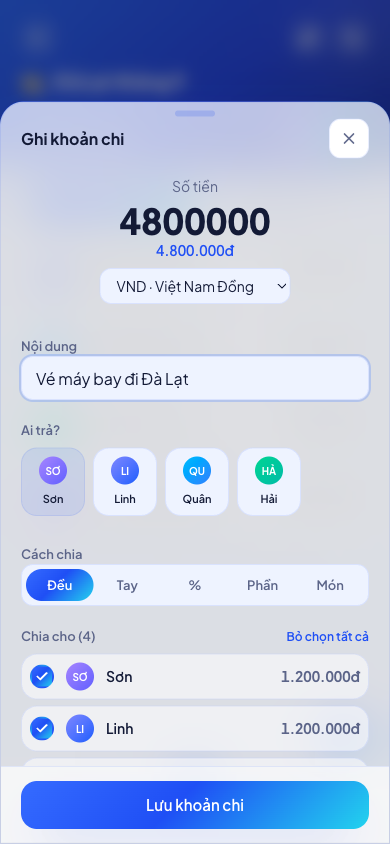
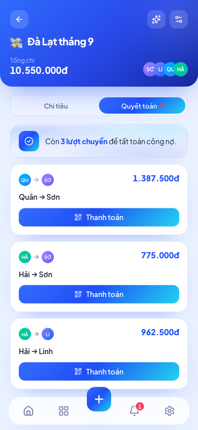
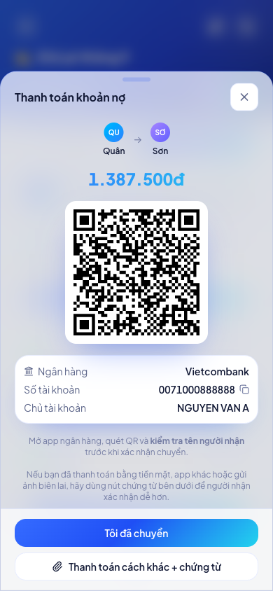
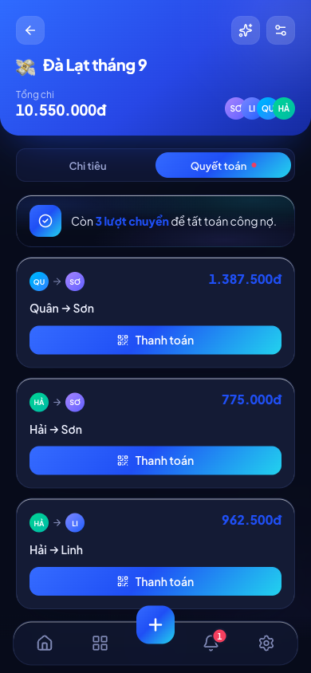

<div align="center">



# Splitz

**The open-source Splitwise alternative — split a group bill, minimize the transfers, settle by QR.**

Works offline · No account required · 5 ways to split · 62 Vietnamese banks

**[▶ Try the live demo](https://splitz.tson.io.vn)**

[](https://github.com/ngthson553-create/splitz/actions/workflows/ci.yml)
[](LICENSE)
[](CONTRIBUTING.md)

| Record an expense | Who owes whom | Settle with VietQR |
|:---:|:---:|:---:|
|  |  |  |

**Three themes**, including **Prestige** — the black-and-gold look reserved for Premium:

| Light | Dark | Prestige |
|:---:|:---:|:---:|
|  |  |  |

A trip, a shared flat, a team lunch — one person pays, everyone else owes their
share, and at the end somebody has to work out who transfers what to whom.
Splitz does that part: it works out the balances, reduces the whole debt to the
**fewest possible bank transfers**, and renders the **VietQR** code that closes
each one.

[Tiếng Việt](README.vi.md) · [Contributing](CONTRIBUTING.md) · [Report an issue](https://github.com/ngthson553-create/splitz/issues)

</div>

---

## Why Splitz?

Adding up a bill is the easy part. Closing a set of debts is the interesting
one: after a 4-person trip you don't want 6 transfers, you want 2 or 3.

Splitz treats that as an algorithm, not an afterthought. Given the balances, it
partitions members into zero-sum groups and solves each one **exactly** — with a
bitmask dynamic program for groups of up to 10 people — so nobody makes a
transfer that could have been avoided. The engine is plain TypeScript with no
UI dependencies, and it is the most tested part of the codebase. There is a
[whole section on it below](#the-settlement-engine).

Splitz is built for Vietnam, so it settles the way Vietnam actually moves
money: **VietQR** — the QR standard every Vietnamese banking app scans — with
BIN codes, names and logos for 62 banks.

> Splitz never holds money and never processes payments. The QR codes it renders
> are built from the receiving member's own bank details; the transfer happens
> in the user's banking app.

## Features

The UI is **bilingual Vietnamese/English** — auto-detected from the browser, switchable in Settings → Language.

**Splitting and settlement**

- Groups and members, with quick add and invite links/codes.
- Expenses with five split modes: **equal**, **exact amounts**, **percentages**,
  **shares**, and **itemized** by line — plus multiple payers on one expense and
  ten currencies for cross-border trips.
- Per-member balances with defined rounding rules, so the sum always matches the
  bill exactly.
- Two settlement strategies: a greedy **Smart settle**, and **fewest transfers**
  (exact bitmask search for up to 10 people, heuristic beyond that).
- Payment proof attached to a settlement, so a group can see a debt was actually
  paid.
- Cross-group debt view: what you owe and are owed across every group.

**Payments**

- VietQR / NAPAS QR generation for 62 Vietnamese banks, with CRC16 check bytes.
- Payee name, bank and account number rendered next to the QR for confirmation.

**Accounts, sync and offline**

- **Local-first by default**: with no backend configured the app stores
  everything in `localStorage` and needs no account at all.
- Optional cloud mode on Supabase: email OTP, Google sign-in, and Zalo sign-in.
- Installable PWA with precaching, so the app opens and works offline.
- Web push and email reminders for upcoming debts.

**Premium**

- Subscription plans billed through **PayOS**, with redemption codes, expiry and
  a grace period.
- The **Prestige** theme — black card, gold accents.

**Admin console**

- A hidden `/console` area with four roles (`owner`, `operator`, `support`,
  `readonly`), enforced in the database rather than the client.
- Audit log, support lookup, email operations, AI operations, health checks,
  scheduled jobs, release notes and data-quality scans.

**AI helpers** (optional; disabled when no key is set)

- Natural-language expense entry ("I paid 250k for lunch for four"), receipt OCR,
  and spending insights. Gemini is the primary provider with DeepSeek as
  fallback.

## Tech stack

| Layer | Choice |
| --- | --- |
| UI | React 19, TypeScript, Tailwind CSS v4, Framer Motion |
| Build | Vite 8, `vite-plugin-pwa` (Workbox) |
| Routing | React Router 7 |
| Backend | Supabase — Postgres, Auth, Row Level Security, Edge Functions (Deno) |
| Payments | PayOS |
| Email / push | Resend, Web Push (VAPID) |
| Analytics / errors | PostHog, Sentry |
| Tests | Vitest, Testing Library, jsdom |

## Quick start

Requires **Node.js 22** (see `.nvmrc`) and npm. No backend, no account, no
configuration:

```bash
git clone https://github.com/ngthson553-create/splitz.git
cd splitz
npm install
npm run dev
```

Open http://127.0.0.1:5173/. The app starts in **local mode** with data in
`localStorage`.

## Cloud mode

Cloud mode adds accounts and syncs groups across devices. It turns on
automatically once `VITE_SUPABASE_URL` and `VITE_SUPABASE_ANON_KEY` are set.

1. **Create a Supabase project.**
2. **Apply the migrations** in `supabase/migrations/` in filename order:
   `supabase db push` with the CLI, or paste them into the SQL editor.
3. **Copy the env template** and fill in the two Supabase values:
   ```bash
   cp .env.example .env.local
   ```
4. **Restart the dev server.** The sign-in screen appears and data moves to
   Postgres.

Optional extras, each independent of the others:

- **Google sign-in** — enable the provider in Supabase and add the callback URL.
- **Zalo sign-in** — set `VITE_ZALO_APP_ID`, then deploy the `zalo-auth` Edge
  Function with its secrets (`supabase secrets set ...`).
- **Premium / PayOS** — deploy `payos-create` and `payos-webhook`, and point the
  PayOS webhook at `https://<project-ref>.functions.supabase.co/payos-webhook`.
- **Reminders** — enable `pg_cron` + `pg_net` and deploy `send-reminders`.
- **Admin console access** — see the bootstrap note at the end of
  `supabase/migrations/0020_admin_console_foundation.sql`. No email is hardcoded
  anywhere; you set the first owner per environment.

Deploy the Edge Functions with `supabase functions deploy <name>`. Their secrets
live in Supabase secrets, never in `.env.local` and never in the repository.

`.env.example` documents every variable and every provider setup step in detail.

## Environment variables

The client only ever sees `VITE_*` variables. Everything else is an Edge Function
secret.

| Variable | Required | Purpose |
| --- | --- | --- |
| `VITE_SUPABASE_URL` | for cloud mode | Supabase project URL. |
| `VITE_SUPABASE_ANON_KEY` | for cloud mode | Supabase publishable key. |
| `VITE_SITE_URL` | for deployment | Public URL, used to build absolute OG/Twitter tags. Defaults to `http://localhost:5173`. |
| `VITE_ZALO_APP_ID` | optional | Enables the Zalo sign-in button. |
| `VITE_ZALO_VERIFICATION` | optional | Emits the Zalo domain-verification meta tag at build time. |
| `VITE_VAPID_PUBLIC_KEY` | optional | Web push subscription. |
| `VITE_POSTHOG_KEY`, `VITE_POSTHOG_HOST` | optional | Product analytics; disabled when empty. |
| `VITE_SENTRY_DSN` | optional | Error reporting; disabled when empty. |

> Forgetting `VITE_SITE_URL` on a deployment leaves `og:image` and `og:url`
> pointing at `localhost`, so link previews break. Set it to your public origin.

## Project structure

```
src/
  lib/
    settlement/        # THE ENGINE: money, balances, smartSettle, maxReduction, vietqr
    data/              # repository pattern: local.ts + supabase.ts, chosen from env
    ai/                # parse-expense, receipt OCR, insights
    store.tsx          # app state, built on the repository
    auth.tsx, theme.tsx, subscription.tsx, notifications.tsx
  components/          # shared primitives (Button, Card, Sheet, ...)
  features/
    home/ group/ groups/ expense/ members/ settle/   # core splitting flow
    auth/ dashboard/ insight/ notifications/ settings/ legal/
    admin/             # the /console area
supabase/
  migrations/          # 34 SQL migrations, applied in order
  functions/           # 18 Deno Edge Functions
docs/                  # Vietnamese design notes, roadmap and architecture handoff
```

## The settlement engine

`src/lib/settlement/` has no dependency on React, the DOM or Supabase. It is
plain TypeScript with the highest test coverage in the project, and it is the
part most worth reading.

**Money is always an integer.** Amounts are stored in minor units (đồng). There
are no floats anywhere in the money path, so nothing drifts.

**Every split adds up to the bill exactly.** When an amount does not divide
evenly, the leftover đồng is distributed by an explicit rule per split mode —
equal and itemized splits hand out the remainder one đồng at a time from the
start of the list; percentage and share splits let the last member absorb it.
The rule is a product decision, not an accident, and the tests pin it down.

**Fewest transfers is solved properly, not approximately.** Given net balances,
`maxReduction` partitions members into independent zero-sum clusters, then solves
each cluster exactly with a bitmask dynamic program (subset-sum over members)
when the group has at most 10 people. Above that the search space grows too
fast, so it falls back to a heuristic. `smartSettle` is the simpler greedy
alternative: sort debtors and creditors, match the largest against the largest,
repeat.

Both are exposed in the settlement screen, so a group can compare "settle in the
fewest transfers" against "settle with the simplest pairing".

**QR codes are built to spec.** `vietqr.ts` emits EMVCo TLV payloads with CRC16
check bytes, plus the BIN, short name and logo URL for 62 Vietnamese banks.

```bash
npm test -- src/lib/settlement
```

## Scripts

| Command | What it does |
| --- | --- |
| `npm run dev` | Vite dev server on http://127.0.0.1:5173/. |
| `npm run build` | Production build into `dist/`. |
| `npm run preview` | Serve the built output locally. |
| `npm test` | Vitest, single run. |
| `npm run lint` | ESLint. |
| `npm run typecheck` | `tsc -b`. |

CI runs lint, typecheck, test and build on every push and pull request.

## Deployment

The frontend is a static SPA — any static host works. The reference deployment is
Cloudflare Pages (build `npm run build`, output `dist/`, SPA fallback already
provided by `public/_redirects`).

Set `VITE_SITE_URL` and any optional `VITE_*` variables in the host's build
environment before the first deploy.

## Self-hosting with Docker

A public image is published to GHCR — running it in local mode (no backend)
is a single command:

```bash
docker run -d -p 8080:80 ghcr.io/ngthson553-create/splitz:latest
```

To bring your own backend (sign-in, sync, storage, edge functions) on a VPS,
`docker-compose.supabase.yml` stands up Postgres 17 + GoTrue + PostgREST +
Storage + Kong with all 34 migrations applied automatically, plus email +
password sign-in that needs no Google Cloud project. Full guide:
[docs/SELF_HOSTING.md](docs/SELF_HOSTING.md).

The image is reconfigurable at runtime through container env vars (`SPLITZ_*`)
— no rebuild needed when you change Supabase or the domain.

## Status and roadmap

Splitz is a working product, not a scaffold: the live demo runs the code in this
repository. The Vietnamese notes in `docs/` are the project's own engineering
record — architecture, roadmap and the admin console specification.

Ideas currently on the table are tracked as
[issues](https://github.com/ngthson553-create/splitz/issues) — including
multi-currency groups, importing from Splitwise, recurring expenses and
translations. If one of them is yours, a pull request is very welcome: start
with [CONTRIBUTING.md](CONTRIBUTING.md), and for anything larger than a bug fix
please open an issue first so we can agree on the approach.

## License

[Apache License 2.0](LICENSE) — see also [NOTICE](NOTICE) for third-party
attribution.

You may use, modify and distribute this software, including commercially,
provided you keep the copyright and license notices. The license also grants an
express patent license.

Splitz is not affiliated with, endorsed by or sponsored by VietQR, NAPAS, PayOS,
Splitwise or any of the banks whose details it can render into a QR code.
